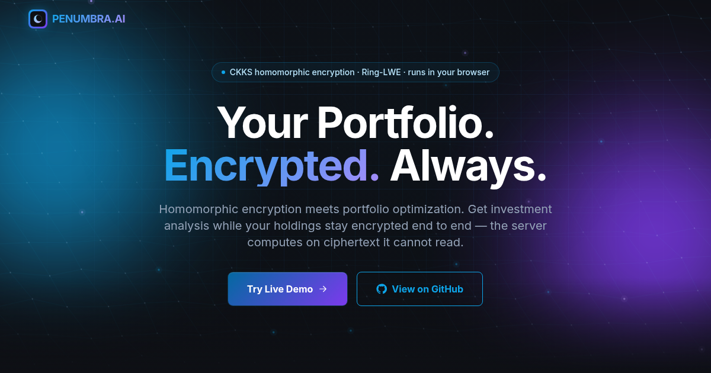

# PENUMBRA.AI

**Your portfolio. Encrypted. Always.**

A privacy-preserving investment advisory system using homomorphic encryption (CKKS). Your portfolio never
touches an unencrypted server. Holdings, quantities and cost basis are encrypted client-side with CKKS
(Microsoft SEAL), sent to the server as ciphertexts, and decrypted only in your browser. The server computes
portfolio value, expected return and Markowitz risk directly on the encrypted data without ever seeing the
plaintext.



## Run it on your laptop

| You are on | Do this |
| --- | --- |
| **Windows** | Double-click **`start.bat`** — installs what it needs, starts the website and the API, opens your browser |
| Windows, no Python | Double-click **`start-website-only.bat`** — the website runs in demo mode |
| macOS / Linux | `bash start.sh` (or `bash start.sh --website-only`) |

Then open **http://localhost:3000**. You need [Node.js](https://nodejs.org) 18 or newer, and for the API,
[Python](https://www.python.org/downloads/) 3.11 – 3.14. The first run takes a few minutes; later runs start
in seconds. Close the two *PENUMBRA* windows (or press Ctrl+C) to stop.

The hero's **System Status** badge tells you what you got: **Online** when the API on port 8000 answers,
**Demo Mode** when it does not. Either way the encryption is real.

## What the website does

The landing page at `/` is the project's front door, and its centrepiece is a **live encryption demo** that
runs real CKKS in the visitor's tab — nothing on it is precomputed:

1. **Encrypt** — generates a keypair (N = 8192, ~32 MB of rotation keys) and encrypts an editable 8-stock
   portfolio, showing the real ciphertext.
2. **Server compute** — a second engine built only from the public bundle tries to decrypt (and is refused),
   then computes portfolio value, expected return and the Markowitz risk term `w⊤Σw` on ciphertext.
3. **Decrypt** — the browser opens the results and checks them against plaintext (relative error ~1e-8).
4. **Results** — risk, return, precision and the rebalance the mean-variance optimizer suggests.

Around it: features, the four-step pipeline, the security model (including what the server *does* learn),
the development roadmap, and a status badge that probes the API every 30 seconds. **Launch App** opens the
full application at `/dashboard` — key management, encrypted portfolio upload, advisor and the Crypto Lab.

| | Measured |
| --- | --- |
| Lighthouse, desktop | 100 performance · 100 accessibility · 100 best practices · 100 SEO |
| Lighthouse, mobile (slow 4G) | 95 · 100 · 100 · 100 |
| Backend tests | 265 passed, 89% coverage |
| Frontend tests | real CKKS in Node for the demo's encrypted operations |

## Deploy

Push to GitHub and import the repository on [Vercel](https://vercel.com/new) — `vercel.json` already
configures the build, SPA routing and security headers. The deployed site runs in demo mode; the backend
stays on your machine or a server of your own. Step by step: **[DEPLOY.md](DEPLOY.md)**.

## Read before the viva

- **[docs/SPEC_DEVIATIONS.md](docs/SPEC_DEVIATIONS.md)** — every departure from the original specification,
  and why.
- **[docs/CRYPTO_ASSUMPTIONS.md](docs/CRYPTO_ASSUMPTIONS.md)** — the threat model, including residual leakage.
- **[docs/ARCHITECTURE.md](docs/ARCHITECTURE.md)** — data flow, depth budget and measured precision.

## Status

| Phase | | Status |
| --- | --- | --- |
| 1 | Encrypted core: CKKS engine, homomorphic ops, keystore, auth, audit, API, frontend | **Built** |
| 2 | Agent orchestration (Planning, Risk, Execution-Simulation) | Specified — endpoints return 501 |
| 3 | QUBO formulation + obfuscation | Specified |
| 4 | Simulated QAOA, benchmarked against the classical baseline | Specified |
| 5 | Durable job pipeline | Planned |
| 6 | node-seal ↔ TenSEAL ciphertext interop | Next |

## Layout

```
backend/     FastAPI + TenSEAL: crypto engine, API, services, 265 tests
frontend/    React + Vite + node-seal: the website (src/landing) and the app
docs/        architecture, threat model, spec deviations
scripts/     start.ps1 (used by start.bat)
start.bat    one-click launcher for Windows      start.sh   the same for macOS / Linux
```

MIT licensed.
